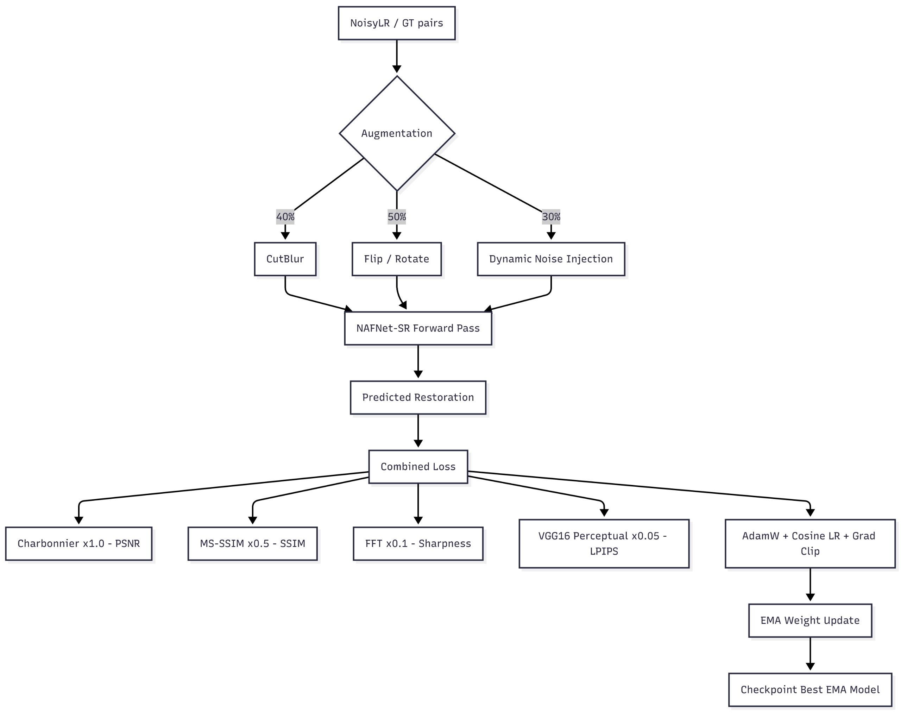
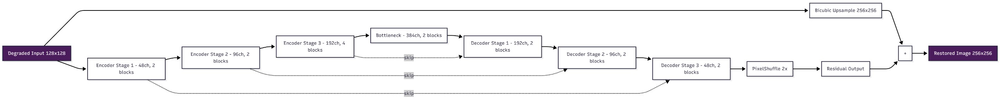
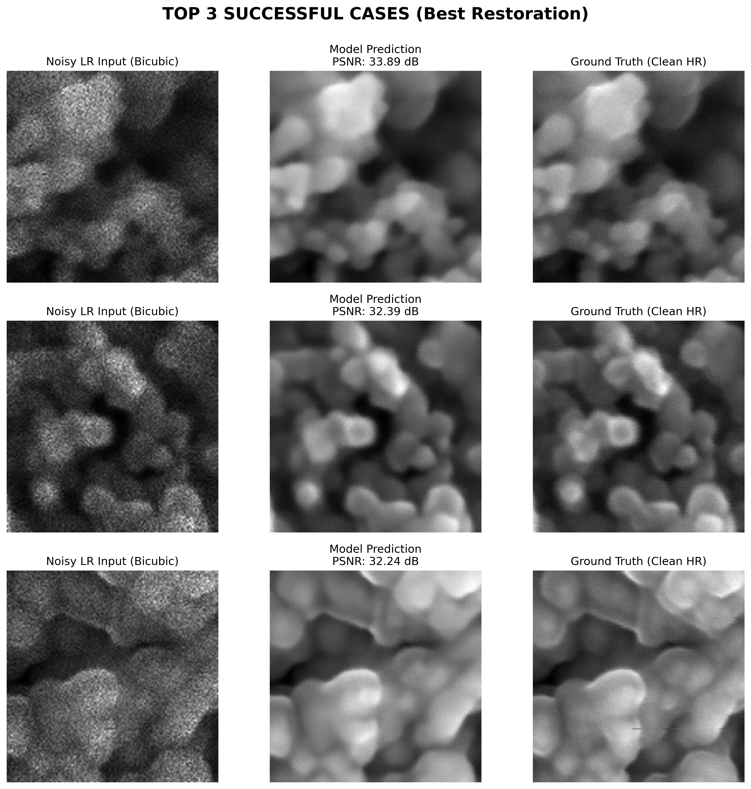
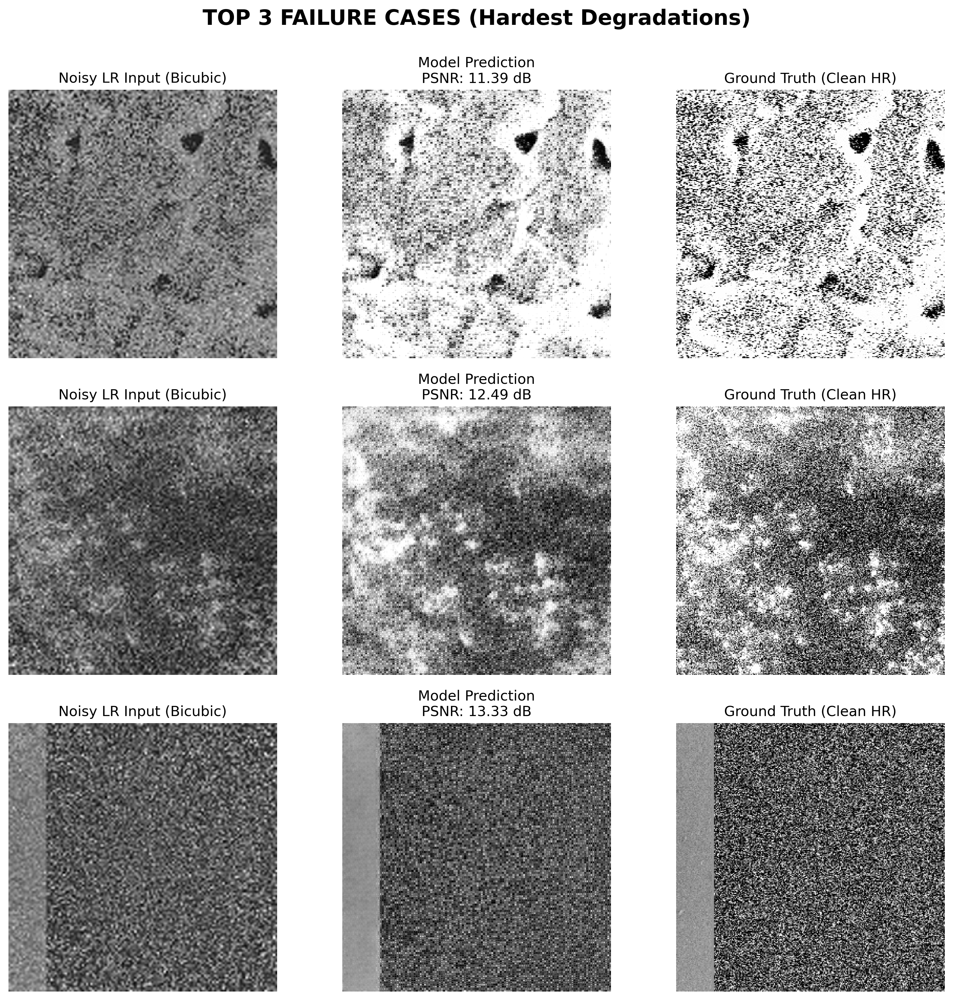

# NAFNet-SR: AI-Based Restoration of Degraded Semiconductor Images

**Team ChipCrafters** — Semicon India Hackathon 2026, KLA Problem Statement (Phase 2)

Joint 2x super-resolution and multi-source denoising for high-speed SEM wafer inspection, built on a NAFNet-style encoder-decoder.

<p align="left">
  
  
  
  
  
  
</p>

\---

## Table of Contents

* [Problem Statement](#problem-statement)
* [Our Approach](#our-approach)
* [Architecture](#architecture)
* [Loss Function](#loss-function)
* [Training Strategy](#training-strategy)
* [Results](#results)
* [Repository Structure](#repository-structure)
* [Getting Started](#getting-started)

  * [Installation](#installation)
  * [Data Preparation](#data-preparation)
  * [Training](#training)
  * [Evaluation / Inference](#evaluation--inference)
* [Innovation Highlights](#innovation-highlights)
* [Tech Stack](#tech-stack)
* [References](#references)
* [Team](#team)
* [License](#license)

\---

## Problem Statement

Semiconductor inspection systems rarely capture perfectly clean images — noise and resolution loss introduced during imaging hide the fine structural detail that downstream defect-inspection tasks depend on.

KLA's dataset pairs each clean ground-truth SEM (Scanning Electron Microscopy) image with a degraded counterpart corrupted by:

* **Speckle noise**
* **Additive Gaussian noise**
* **Downsampling** (resolution loss, applied in an undisclosed combination/order)

**Goal:** Reverse these degradations and reconstruct an image as close as possible to the original — without hallucinating detail or destroying real structure — while generalizing to unseen (out-of-distribution) test content and running efficiently on GPU hardware (benchmarked end-to-end on an NVIDIA H100, including I/O and batching).

## Our Approach

In Phase 1 we built a NAFNet-based U-Net that jointly denoises and super-resolves in a single forward pass. In Phase 2, we scaled that idea into **NAFNet-SR**, trained and validated directly on KLA's paired dataset (4,785 `NoisyLR`/`GT` `.npy` pairs, 128×128 → 256×256), closing the gap between the theoretical design and measured, reproducible performance.

Key design principle: the model predicts a **residual correction on top of a bicubic-upsampled input**, rather than reconstructing the image from scratch. This keeps training stable and convergence fast, even with added architectural depth.


<p align="center">


; 


</p>


## Architecture

**NAFNet-SR** — a UNet-style encoder-decoder built entirely from Nonlinear-Activation-Free (NAF) blocks.

|Component|Detail|
|-|-|
|Encoder|3 stages, `\\\[2, 2, 4]` blocks, channels `48 → 96 → 192 → 384`|
|Bottleneck|2 NAFBlocks on the compressed representation|
|Decoder|3 stages, `\\\[2, 2, 2]` blocks, PixelShuffle upsampling + encoder skip connections|
|Block design|SimpleGate activation + Spatial/Channel Attention (squeeze-and-excitation) instead of conventional nonlinearities — better gradient flow|
|Upsampling|Sub-pixel PixelShuffle convolutions for artifact-free 2x super-resolution|
|Output|Residual added to a bicubic-upsampled version of the input|
|Parameters|≈ 4.88M (vs. 2.65M in Phase 1)|

Restoration is fully end-to-end: **one forward pass** performs denoising and 2x super-resolution simultaneously.


<p align="center">


; 


</p>


## Loss Function

A four-term composite loss, each term deliberately mapped to one of KLA's scored metrics:

|Term|Weight|Target Metric|Purpose|
|-|-|-|-|
|Charbonnier loss|1.0|PSNR|Robust pixel-level accuracy|
|MS-SSIM loss|0.5|SSIM|Multi-scale structural fidelity|
|FFT-domain loss|0.1|Edge sharpness|Recovers high-frequency detail|
|VGG16 perceptual loss|0.05|LPIPS|Visual/perceptual quality|

Improving this loss directly improves leaderboard score, rather than optimizing a loose proxy objective.

## Training Strategy

* **Augmentation:**

  * CutBlur (40% probability) — swaps a random patch between the upsampled-degraded and ground-truth images, teaching spatially adaptive restoration instead of uniform sharpening
  * Random flips / 90° rotations (50%)
  * Dynamic Gaussian noise injection (30%, σ = 0.01–0.05) for robustness to unseen noise strengths
* **Optimizer:** AdamW (lr = 1e-3, weight decay = 1e-4), cosine-annealed to 1e-6 over 45 epochs
* **Stability:** Gradient clipping (norm 1.0), mixed-precision (fp16/AMP) training
* **Weight averaging:** Exponential Moving Average (decay = 0.999) — the EMA shadow model is what gets evaluated and checkpointed
* **Reproducibility:** Fixed global seed (42) across Python, NumPy, PyTorch/CUDA
* **Data split:** 90/10 train/validation, files auto-discovered and matched by numeric ID

## Results

Evaluated at epoch 45 on the full held-out validation set, against KLA's three scored metrics:

|Metric|Result|Target|Notes|
|-|-|-|-|
|**SSIM**|0.8961|0.90|Within 0.4% of target|
|**PSNR (avg)**|23.85 dB|30+ dB|Peaks of 33.89 dB / 32.39 dB on strong cases|
|**LPIPS**|0.3337|\~0.3|Close to target|
|Baseline (bicubic)|PSNR 20.10 / SSIM 0.501|—|For comparison|

The model clearly outperforms the bicubic-upsampling baseline on structural similarity, confirming the multi-loss strategy recovers real structural detail rather than just averaging pixels. Average PSNR is pulled down by a harder subset of test images, while performance on recoverable-degradation images is strong.

Two experimental alternatives were also evaluated for comparison and ultimately outperformed by NAFNet-SR:

|Model|Params|PSNR|SSIM|
|-|-|-|-|
|ResidualSRModel (6 residual blocks, L1 loss)|518K|23.55 dB|0.578|
|SharpSRNet (12-block RRDBNet-style, tiled inference)|—|23–24 dB|\~0.65|
|**NAFNet-SR (this repo)**|**4.88M**|**23.85 dB**|**0.8961**|

## 

\\\*Top Successful Cases (Best Restoration):\\\*


<p align="center">


; 


</p>


\\\*Failure Cases Analysis (Hardest Degradations):\\\*


<p align="center">


; 


</p>


## Repository Structure

```
.
├── data/                     # NoisyLR/ and GT/ .npy pairs (not included — see Data Preparation)
├── src/
│   ├── config.py              # Config class — hyperparameters, paths
│   ├── dataset.py              # Dataset discovery, pairing, augmentation (CutBlur, flips, noise)
│   ├── model.py                # NAFNetSR + NAFBlock definitions
│   ├── losses.py                # HackathonRestorationLoss (Charbonnier + MS-SSIM + FFT + VGG16)
│   ├── ema.py                    # EMA weight wrapper
│   ├── train.py                   # Training loop, checkpointing, scheduler
│   └── evaluate.py                 # PSNR / SSIM / LPIPS evaluation utilities
├── scripts/
│   ├── run\\\_inference.py       # Standalone evaluation script (CLI: --test-dir --output-dir)
│   └── benchmark\\\_inference.py # End-to-end H100 inference-time benchmark
├── notebooks/
│   └── kla-ps-semicon26.ipynb # Kaggle training/experimentation notebook
├── requirements.txt            # pip freeze environment spec
└── README.md
```

## Getting Started

### Installation

```bash
git clone https://github.com/<your-org>/<your-repo>.git
cd <your-repo>
pip install -r requirements.txt
```

Core dependencies: `torch`, `torchvision`, `pytorch-msssim`, `lpips`, `scikit-image`, `numpy`.

### Data Preparation

Place paired `.npy` files under `data/NoisyLR/` and `data/GT/`, matched by numeric file ID (e.g. `0001.npy` in both folders). The dataset loader auto-discovers and pairs files by regex on the ID — no manual path configuration needed.

### Training

```bash
python src/train.py --data-dir data/ --epochs 45 --batch-size 8
```

### Evaluation / Inference

Standalone, non-notebook script that accepts a test directory and output directory (as required by the KLA submission format):

```bash
python scripts/run\\\_inference.py --test-dir <path/to/test> --output-dir <path/to/output>
```

This produces restored images and reports PSNR / SSIM / LPIPS, plus an end-to-end inference-time benchmark (I/O + batching + inference) suitable for H100 evaluation.

## Innovation Highlights

* **Metric-aligned loss decomposition** — each loss term is chosen to move a specific scored metric (Charbonnier → PSNR, MS-SSIM → SSIM, FFT → sharpness, VGG perceptual → LPIPS)
* **CutBlur augmentation** — a technique from state-of-the-art super-resolution research, uncommon at hackathon scale, that teaches localized/adaptive restoration
* **EMA-averaged final weights** — measurably more stable validation performance epoch-to-epoch than raw training weights
* **Deeper yet still efficient** — 4.88M params (up from 2.65M) while staying lightweight via gating + attention instead of standard activations
* **OOD robustness by design** — dynamic noise injection during training directly targets KLA's out-of-distribution generalization criterion
* **Stable mixed-precision pipeline** — fused AdamW + gradient clipping + AMP avoids the NaN/divergence issues common in naive fp16 restoration training

## Tech Stack

* **Framework:** PyTorch + torchvision (CUDA, AMP, fused AdamW where available; automatic CPU fallback)
* **Loss/metrics libraries:** `pytorch-msssim`, `lpips` (Zhang et al., 2018), `scikit-image`
* **Backbone reuse:** VGG16 (perceptual loss only, not used for restoration itself)
* **Compute:** Kaggle GPU notebooks (16GB VRAM, batch size 8) for development and training

## References

1. Chen et al. (2022). *Simple Baselines for Image Restoration* (NAFNet). [arXiv:2204.04676](https://arxiv.org/abs/2204.04676)
2. Zhang et al. (2018). *The Unreasonable Effectiveness of Deep Features as a Perceptual Metric* (LPIPS). [arXiv:1801.03924](https://arxiv.org/abs/1801.03924)
3. Wang et al. (2003). *Multiscale Structural Similarity for Image Quality Assessment* (MS-SSIM). [IEEE](https://ieeexplore.ieee.org/document/1292216)
4. Yoo et al. (2020). *Rethinking Data Augmentation for Image Super-resolution: A Comprehensive Analysis and a New Strategy* (CutBlur). [arXiv:2004.00448](https://arxiv.org/abs/2004.00448)

Dataset (Phase 1) derived from the NFFA-EUROPE 100% SEM Dataset, used under CC-BY 4.0.

## Team

**Team ChipCrafters** — Electronics Engineering students, Shah and Anchor Kutchhi Engineering College

|Role|Name|
|-|-|
|Team Leader|Pallavi Tiwari|
|Member|Ishita Agrawal|
|Member|Anjali Dadipally|
|Member|Vaishnavi Maranhole|

## License

Add your chosen license here (e.g. MIT) — check dataset terms (CC-BY 4.0 for NFFA-EUROPE) if redistributing any data.

